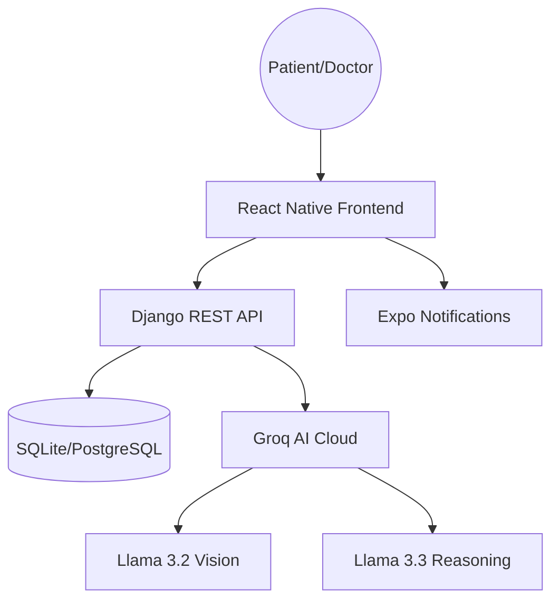

# 🏥 Arogya AI: Your Post-Discharge Health Companion

[](https://opensource.org/licenses/MIT)
[](https://groq.com/)

**Arogya** (Sanskrit for "Health") is a cutting-edge, AI-driven healthcare platform designed to bridge the critical gap between hospital discharge and full recovery. By leveraging state-of-the-art Large Language Models and computer vision, Arogya ensures that patients are never alone during their recovery journey.

---

## 🚀 Key Features

### 🧠 Intelligent AI Health Suite
*   **AI Report Deep-Dive**: Upload complex clinical discharge summaries (PDF/Images). Our system uses **Groq Llama 3.2 Vision** to extract health markers, simplify medical jargon, and identify prescribed medications automatically.
*   **Smart Medication Alarms**: No more manual data entry. The AI extracts your medication schedule and automatically sets **recurring daily alarms** on your device via Expo Notifications.
*   **Proactive Symptom Checker**: Feeling unwell? Chat with Arogya AI. It analyzes your symptoms against your recent medical history to provide empathetic guidance and risk classification.

### 👨‍⚕️ Professional Care Circle
*   **Direct Doctor Chat**: Secure, real-time messaging with your assigned specialist.
*   **Risk-Stratified Check-ins**: Daily assessments that use AI to classify your status into *Normal*, *Warning*, or *Emergency*, instantly alerting your care team if complications are detected.
*   **Doctor Dashboard**: A specialized view for medical professionals to monitor patient recovery, verify AI-extracted reports, and manage urgent alerts.

---

## 🛠️ Technology Stack

| Component | Technology |
| :--- | :--- |
| **Frontend** | React Native (Expo), TypeScript, Expo Router |
| **Backend** | Python, Django REST Framework, SQLite |
| **AI Reasoning** | Groq Llama 3.3 70B (High-accuracy reasoning) |
| **Vision/OCR** | Groq Llama 3.2 11B Vision (Clinical report parsing) |
| **Notifications** | Expo Notifications (Local Scheduling) |
| **Styling** | Custom Design System (Teal Theme) |

---

## 🏗️ Architecture



---

## 📥 Installation & Setup

### 1. Backend Setup
```bash
# Navigate to backend
cd projects/Arogya/src/backend/Arogya

# Install dependencies
pip install -r requirements.txt

# Configure Environment
# Create a .env file with:
# GROQ_API_KEY=your_key_here
# DEBUG=True

# Run migrations & Start
python manage.py migrate
python manage.py runserver
```

### 2. Frontend Setup
```bash
# Navigate to frontend
cd projects/Arogya/src/frontend

# Install dependencies
npm install

# Start Expo
npx expo start --clear
```

---

## 🛡️ Responsible AI & Security
Arogya is built with medical ethics at its core.
- **Medical Disclaimer**: Every AI response includes a clear disclaimer that the assistant is not a doctor.
- **Data Privacy**: All clinical reports are processed through secure API channels and never used for model retraining.
- **Human-in-the-loop**: Doctors have the final say in verifying AI-extracted reports before they are permanently added to the medical record.

---

## 👥 Development Team
*   **Puspa** - Lead Systems Architect
*   **Arogya AI** - Cognitive Integration

---

## 📄 License
This project is licensed under the MIT License - see the [LICENSE](LICENSE) file for details.